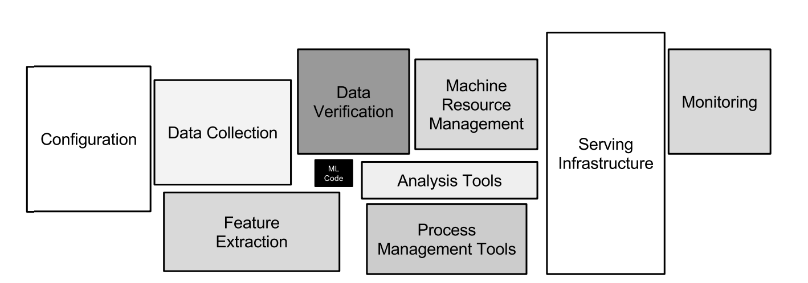

# Pasos para Productivizar un Modelo de Machine Learning

La productivización de un modelo de machine learning implica transformar un prototipo funcional en una solución robusta y escalable. Aunque parezca trivial esto es uno de los puntos críticos donde muchos de los proyectos de Machine Learning fallan.

[Artículo original](https://proceedings.neurips.cc/paper_files/paper/2015/file/86df7dcfd896fcaf2674f757a2463eba-Paper.pdf)

Es un ciclo de vida complejo al que deberemos prestar mucha atención ya que un modelo mal entrenado o con un rendimiento ineficiente puede generar perdidas astronómicas de forma muy rápida.

A continuación se describen los pasos clave y recursos recomendados:

## 1. Prototipado

El primer paso consiste en crear un prototipo del modelo para validar su funcionamiento y utilidad. Puede ser complejo generar una aplicación sencilla que nos permita probar el correcto funcionamiento del modelo o al menos ejemplificar su uso.

Herramientas como [Streamlit](https://streamlit.io/) o [Gradio](https://www.gradio.app/) permiten construir aplicaciones interactivas de manera rápida y sencilla, facilitando la visualización de resultados y la interacción con el modelo.

Los espacios de HuggingFace son una forma sencilla de ver cómo se utilizan estos entornos:

* Ejemplo con Streamlit https://huggingface.co/spaces/pkr1234/titanic-survival-prediction
* Ejemplo con Gradio: https://huggingface.co/spaces/Hargurjeet/iris

## 2. Registro de Experimentos y Modelos

Para asegurar la reproducibilidad y trazabilidad de los experimentos, es fundamental registrar los parámetros, métricas y versiones de los modelos. [MLflow](https://mlflow.org/) es una plataforma popular que permite gestionar el ciclo de vida completo de los modelos, desde el registro de experimentos hasta el almacenamiento y despliegue de modelos.

## 3. Puesta en Marcha (Despliegue)

El despliegue del modelo puede realizarse como una API, microservicio o integrarse en una aplicación existente. Es importante considerar aspectos como la escalabilidad, monitorización y actualización continua del modelo. Recursos como [FastAPI](https://fastapi.tiangolo.com/) o servicios cloud (AWS SageMaker, Azure ML) pueden facilitar este proceso.

## 4. Observabilidad de Modelos

La observabilidad permite monitorizar el comportamiento del modelo en producción, detectar desviaciones, y asegurar su rendimiento y fiabilidad. Es recomendable implementar métricas como precisión, latencia, tasa de errores y distribución de datos de entrada. Herramientas como [Prometheus](https://prometheus.io/), [Grafana](https://grafana.com/) y soluciones específicas de MLOps (por ejemplo, [NannyML](https://www.nannyml.com/)) ayudan a visualizar y alertar sobre posibles incidencias o degradaciones en el modelo.

Tras estas piezas y haber automatizado lo máximo posible, nuestro ciclo de entrenamiento de modelos tendrá una pinta algo más similar a esta:

Más adelante lo veremos en más detalle pero esta es una de las razones por la que los orquestadores corporativos se vuelven críticos en el mundo del ML.

## 5. Documentación

Siempre nos cuesta este punto pero un correcto uso de nuestros modelos o soluciones siempre va asociado a una buena documentación. Clara, sencilla de buscar y con ejemplos. Pueden volverse muy grandes pero debemos procurar que siempre sea sencillo buscar lo que necesitamos. Un claro ejemplo son las documentaciones de:

* Scikit-learn: https://scikit-learn.org/stable/
* Streamlit: https://docs.streamlit.io/
* FastAPI: https://fastapi.tiangolo.com/

Pensaréis que estas documentaciones tienen equipos de desarrollo detrás, pero muchas veces se trata de una única persona que además puede que ni sepa programar páginas web (bueno, quizás algo sí). Estas documentaciones son posibles gracias a frameworks que nos ayudan a montar el grueso de la aplicación y solo requieren que nosotros rellenemos el contenido, empleando Markdown además para no tener que aprender demasiadas cosas nuevas.

* Sphinx: https://www.sphinx-doc.org/en/master/
* Material for MkDocs: https://squidfunk.github.io/mkdocs-material/
* Quarto: https://quarto.org/

Pudiendo además hospedarlas de forma gratuita en plataformas como [ReadTheDocs](https://about.readthedocs.com/) o el mismo [Github Pages](https://pages.github.com/). En el mundo de los modelos existen dos estándares de los que no nos deberíamos olvidar:

* Data Cards: https://sites.research.google/datacardsplaybook/
* Model Cards: https://modelcards.withgoogle.com/

Un buen ejemplo de estas tarjetas lo podemos encontrar en las descripciones de los modelos de HuggingFace:

* Go emotions: https://huggingface.co/datasets/google-research-datasets/go_emotions
* Gemma-3n: https://huggingface.co/google/gemma-3n-E4B-it 

### Recursos adicionales

- [Guía de MLOps de Google](https://cloud.google.com/architecture/mlops-continuous-delivery-and-automation-pipelines-in-machine-learning)
- [Documentación oficial de MLflow](https://mlflow.org/docs/latest/index.html)
- [Streamlit Docs](https://docs.streamlit.io/)
- [NannyML](https://www.nannyml.com/)

Estos pasos y herramientas ayudan a garantizar que el modelo pase de ser un prototipo experimental a una solución productiva y mantenible.